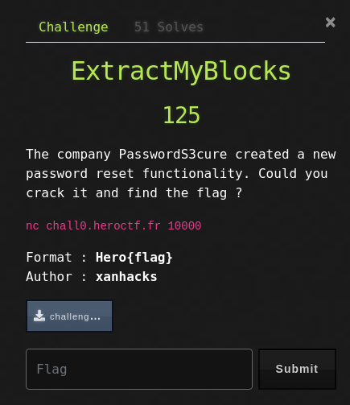

# W-u of ExtractMyBlocks
<br>
## Block make us think about AES ! 
So when we chack the given script, we can see that is actually AES - ECB<br>
When we sent a random text in the Account Id field it returns back : <br>
```
Welcome back {account_id} !

Your password : {FLAG}

Regards
```
<br>
Encrypted in AES, that looks like :

<br>

### We know that the block size is 32 hex char. So we can cut the request in blocks like this : <br>
<br>

So know we can start the attack, we have to send a specific amount of char to see when a new block is created. I counted the bytes in the previous message and i found :
```
============== 3 blocks ===========  1 block    1 block
[14 bytes] + [payload] + [20 bytes] + [flag] + [10 bytes]

14 bytes for "\n Welcome back" 
20 bytes for " ! \n \nYour password : "
And our payload, this all make 3 blocks of 48 bytes, so our payload might be 14 bytes long
```
<br>
The attack is based on extract the chars of the flag one by one. The tricks is : if we build a payload that is 13 bytes long instead of 14, there is 1 byte left, and it's a flag byte !
Here is my script :<br>

```python
from pwn import *
from string import printable
context.log_level = "error"
#Divides in 32 char long blocks 
def get_block(token):
    new = []
    for i in range (0, len(token), block_size):
        new.append(token[i:i+block_size])
    return new

block_size = 32
auth_length = 129
"""
The payload, why it looks like this, because i take the 13th chars before the flag, is "our password : ",  but it has to be in the same block, but the previous block is 14 bytes long, so i add 2 random char before.
"""
line = ['z','a','o','u','r',' ','p','a','s','s','w','o','r','d',' ',':',' ']
flag = []

def get_the_flag() :
    offset = 13
    while line[-1] != "}":
        """
        Here i send a 13A to get the block with the flag char
        So i will brute force the last char to get a char that produces the extact same block.
        """
        r = remote("chall0.heroctf.fr",10000)
        t = r.recv().decode()
        r.sendline("A"*(offset))
        t = r.recv().decode()
        block_sould_be = get_block(t)[2]

        """
        Here i test every printable char and check if the block i get is equals to the "should_be_block".
        """
        for c in printable:
            r = remote("chall0.heroctf.fr",10000)
            t = r.recv().decode()
            r.sendline("".join(line)+c)
            t = r.recv().decode()
            block = get_block(t)
            if block_sould_be == block[1]:
                """
                When i found a char, I remove the first char of my payload and add the char I found.
                """
                line.append(c)
                flag.append(c)
                line.pop(0)
                offset -= 1
                print("".join(flag))
get_the_flag()
```
<br>
Launch the script and the flag pops up !
Hero{_BL0CK5_}
